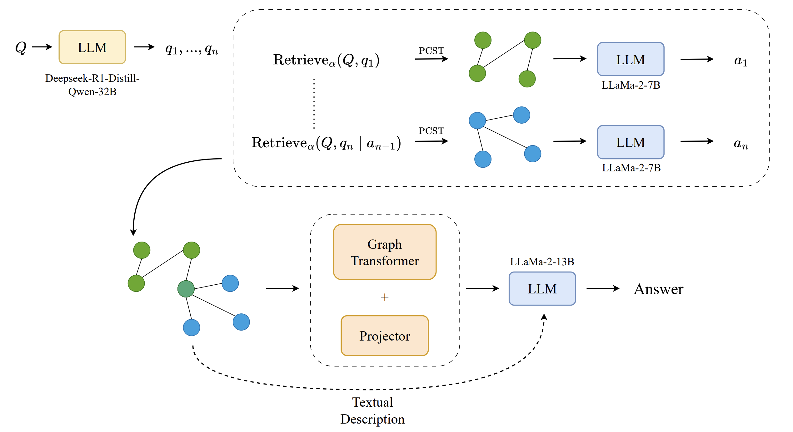

---

##### Download

+ [Paper](https://arxiv.org/abs/2506.13380)
+ [More about CEA-LIST](https://list.cea.fr/en/)
+ Code and data (will be released soon)

---

##### Abstract

Large Language Models (LLMs) excel at many NLP tasks, but struggle with multi-hop reasoning and factual consistency, limiting their effectiveness on knowledge-intensive tasks like complex question answering (QA). Linking Knowledge Graphs (KG) and LLMs has shown promising results, but LLMs generally lack the ability to reason efficiently over graph-structured information. To tackle this problem, we propose a novel retrieval approach that integrates textual knowledge graphs into the LLM reasoning process via query decomposition. Our method decomposes complex questions into sub-questions, retrieves relevant textual subgraphs, and composes a question-specific knowledge graph to guide answer generation. For that, we use a weighted similarity function that focuses on both the complex question and the generated subquestions to extract a relevant subgraph, which allows efficient and precise retrieval for complex questions and improves the performance of LLMs on multi-hop QA tasks. This structured reasoning pipeline enhances factual grounding and interpretability while leveraging the generative strengths of LLMs. We evaluate our method on standard multi-hop QA benchmarks and show that it achieves comparable or superior performance to competitive existing methods, using smaller models and fewer LLM calls.

---

##### Pipeline Illustration



---

##### Citation

```BibTeX
@misc{six2025decompositionalreasoninggraphretrieval,
      title={Decompositional Reasoning for Graph Retrieval with Large Language 
      Models},  
      author={Valentin Six and Evan Dufraisse and Gaël de Chalendar},
      year={2025},
      eprint={2506.13380},
      archivePrefix={arXiv},
      primaryClass={cs.CL},
      url={https://arxiv.org/abs/2506.13380}, 
}
```

