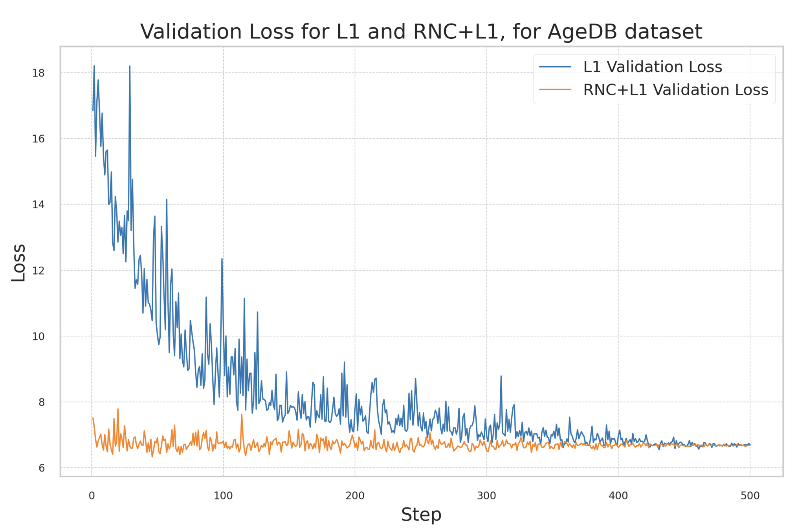

---

##### Download

+ [Paper](https://arxiv.org/abs/2411.16298)
+ [Code and data](https://github.com/kaiwenzha/Rank-N-Contrast)

---

##### Abstract

This document is an evaluation of the original "Rank-N-Contrast" (arXiv:2210.01189v2) paper published in 2023. This evaluation is done for academic purposes. Deep regression models often fail to capture the continuous nature of sample orders, creating fragmented representations and suboptimal performance. To address this, we reproduced the Rank-N-Contrast (RNC) framework, which learns continuous representations by contrasting samples by their rankings in the target space. Our study validates RNC's theoretical and empirical benefits, including improved performance and robustness. We extended the evaluation to an additional regression dataset and conducted robustness tests using a holdout method, where a specific range of continuous data was excluded from the training set. This approach assessed the model's ability to generalise to unseen data and achieve state-of-the-art performance. This replication study validates the original findings and broadens the understanding of RNC's applicability and robustness.

---

##### Figure 2: Dimensions of a sausage dog



---

##### Citation

```BibTeX
@misc{six2025evaluatingrankncontrastcontinuousrobust,
      title={Evaluating Rank-N-Contrast: Continuous and Robust Representations for Regression}, 
      author={Valentin Six and Alexandre Chidiac and Arkin Worlikar},
      year={2025},
      eprint={2411.16298},
      archivePrefix={arXiv},
      primaryClass={cs.LG},
      url={https://arxiv.org/abs/2411.16298}, 
}
```
