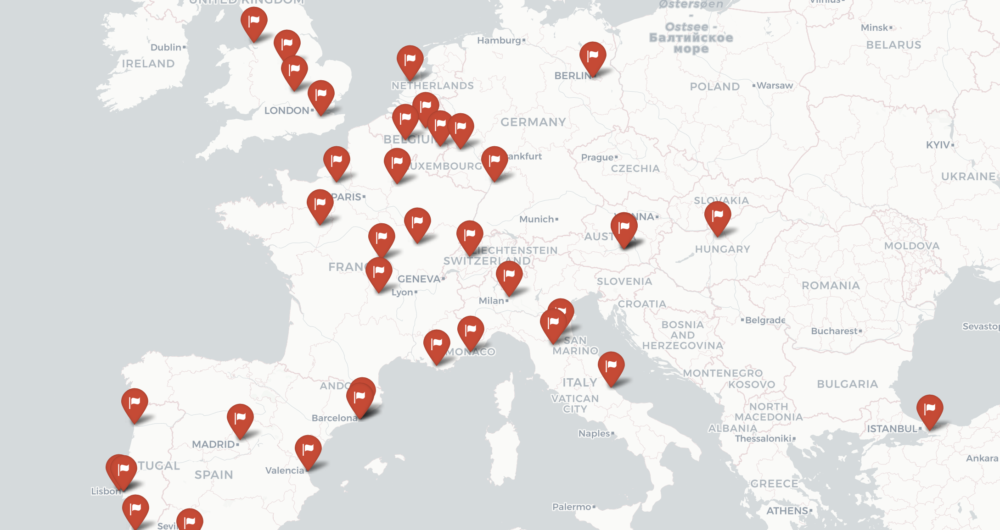

  <meta http-equiv='cache-control' content='no-cache'>
  <meta http-equiv='expires' content='0'>
  <meta http-equiv='pragma' content='no-cache'>

## Portfolio

---

### Machine Learning Projects 

[Predicting Insurance Costs using Ensemble Methods](ML/ML_1/ML_Project_1.md)

[Accuracy of Various Models in Heart Diseases Detection](ML/ML_2/ML_Project_2.md)

[Two Methods for Calculating EA Sports FC 24 Player Overall Rating](ML/ML_3/ML_Project_3.md)

### Deep Learning Projects 

[Building a CNN for Sport Image Classification](DL/DL_1/DL_Project_1.md)

[Natural Language Processing for Sarcasm Detection](DL/DL_2/DL_Project_2.md)

## Visuals

---
